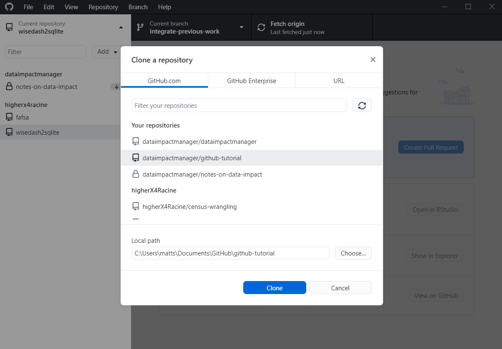
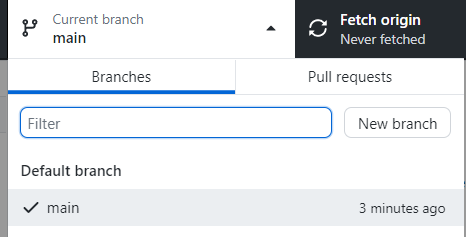
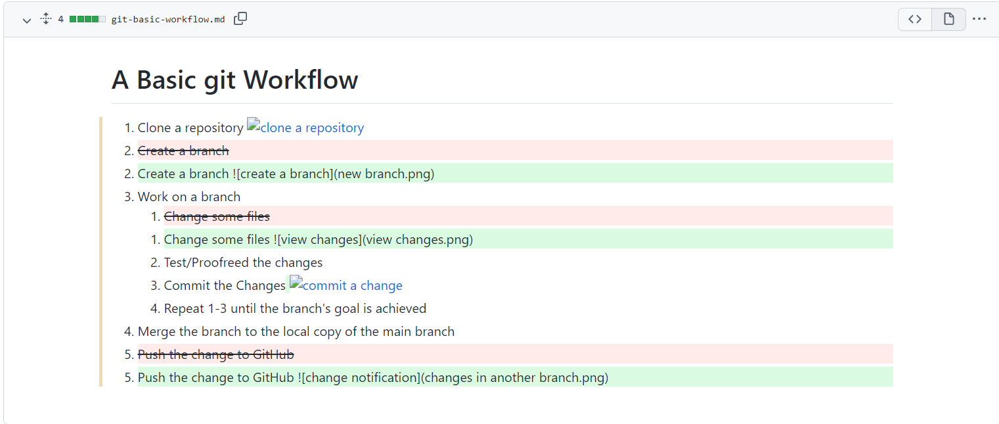
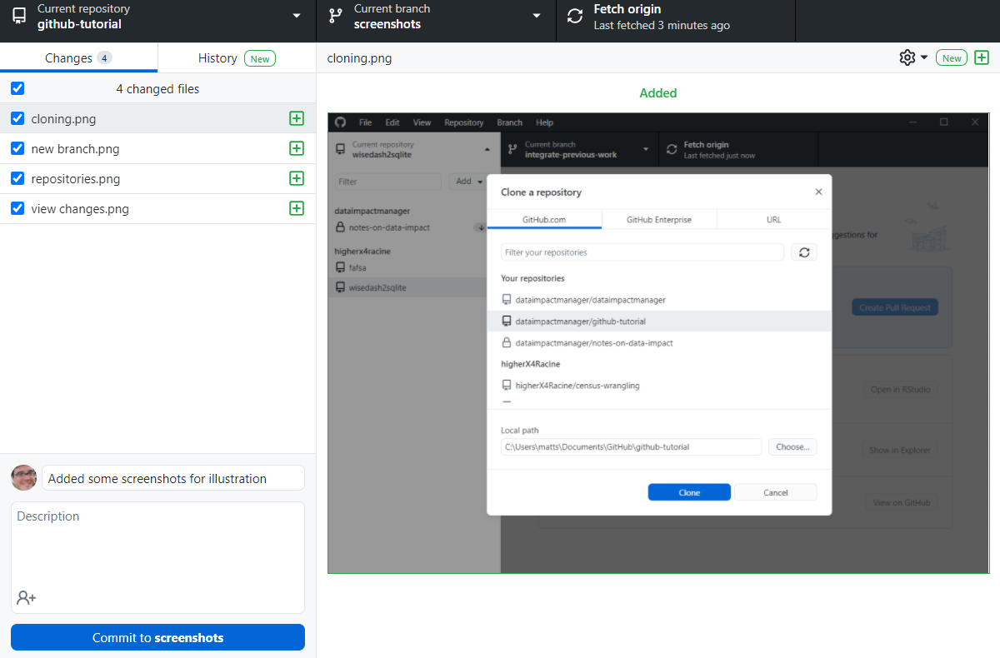
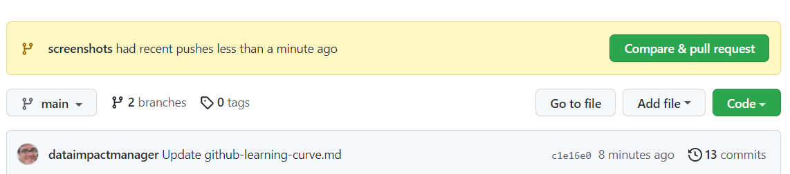

# A Basic git Workflow

1. Clone a repository

   

2. Create a branch

   

3. Work on a branch

   1. Change some files

      

   2. Test/Proofreed the changes
   3. Commit the Changes

      

   4. Repeat 1-3 until the branch's goal is achieved

4. Merge the branch to the local copy of the main branch

5. Push the change to GitHub

   
